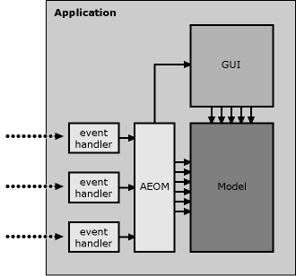

# Understanding Apple events

This chapter introduces the main concepts behind Apple event-based application scripting.

## What are Apple events?

Apple events are a high-level message-based form of Interprocess Communication (IPC), used to communicate between local or remote application processes (and, in some cases, within the same process).

An Apple event contains:

* several predefined _attributes_ describing how the event should be handled, such as the event's 'name' (specified by two `OSType` values [<a href="#f1">1</a>]) and whether or not a reply is required

* zero or more _parameters_ to the event handler that receives the event.

[TO DO: 'descriptor', typed]

Apple event datatypes include:

* common scalar types such as booleans, integers, floats, strings, dates and file references

* ordered lists

* records (key-value lists where each key is an four-letter code)

* object specifiers, used to construct _first-class queries_ (also known as _references_ in AppleScript), that identify objects within an application. These query objects are roughly comparable to XPath or CSS selectors.

For example, when the user drag-n-drops a file onto TextEdit.app in the Finder, the Finder commands TextEdit to open that file by sending it an `aevt/odoc` event with a file reference as its main parameter:

With suitable bindings, programming languages can also create and send Apple events. For example, when the code `iTunes().play()` is executed by a client application, a `hook/Play` event is sent from the client application to iTunes, instructing it to start playing:

Applications may respond to an incoming Apple event by sending a reply event back to the client application. The reply event may contain either a return value, if there is one, or an error description if it was unable to handle the event as requested. For example, executing the command `TextEdit().name.get()` in a client appliation sends TextEdit a `core/getd` event containing an object specifier identifying the `name` property of its root `application` object. TextEdit processes this event, then sends a reply event containing the string '<tt>TextEdit</tt>' back to the client application, where it is returned as the command's result. This exchange is usually performed synchronously, appearing to the user as a simple remote procedure call. Asynchronous messaging is also supported, though is not normally used in application scripting.

## What is a scriptable application?

A scriptable (or 'AppleScriptable') application is an application that provides an Apple event interface intended for third-party (e.g. end-user) use. The application implements one or more event handlers that respond to corresponding events, and may also support the Apple Event Object Model. While this interface may be regarded as an API, the emphasis is on providing a high-level _user interface_ that is peer to other users interfaces the application may have (GUI, CLI, web, etc.) and accessible to end-users as much as developers.

For example, iTunes.app implements two user interfaces, one graphical and one Apple event-based, that provide access to to much the same functionality but in very different ways:

A scriptable application also contains a built-in definition of its scripting interface in the form of an `aete` or `sdef` resource. This resource can be obtained programmatically and used:

* to support automatic translation of human-readable terminology to four-letter codes in high-level bridges such as AppleScript and AppleEventBridge

* to generate basic human-readable documentation by applications such as AppleScript Editor.

(Note that the `aete` and `sdef` formats do not provide an exhaustive description of the application's scripting interface, and additional documentation is usually required - if not always provided - to form a complete understanding of that interface and how to use it effectively.)

## What is the Apple Event Object Model?

The Apple Event Object Model (AEOM) is a View-Controller layer that provides an idealized, user-friendly representation of the application's internal data, allowing clients to identify and manipulate parts of that structure via Apple events. An incoming Apple event representing a particular command (get, set, move, etc.) is unpacked, and any object specifiers in its parameter list are evaluated against the application's AEOM to identify the user-level object(s) upon which the command should act. The command is then applied these objects, with the AEOM translating this into operations upon the application's implementation-level objects. These implementation-level objects are mostly user-data objects in the application's Model layer, plus a few GUI View objects of interest to scripters (such as those representing document windows). The internal architecture of a typical scriptable desktop application might look something like this:

* The AEOM represents user data as an object graph (nominally tree-shaped) whose nodes are connected via one-to-one and/or one-to-many relationships.

* AEOM objects are identified by high-level queries (comparable to XPath or CSS selectors), not low-level chained method calls.

* Commands operate upon objects, so a single command may invoke multiple method calls upon multiple implementation objects in order to perform relatively complex tasks.

* Where a query specifies multiple objects, the command should perform the same action on each of them [<a href="#f2">2</a>].

* AEOM objects never move across the bridge. Where a command identifies one or more AEOM objects as its result, the return value is a query (or queries) that will [hopefully] identify those objects in future, not the AEOM objects themselves.

(While the Apple Event Object Model is sometimes described by third-parties as being similar to DOM, this is inaccurate as AEOM operates at a much higher level of abstraction than DOM.)

## How does the AEOM work?

The AEOM is a tree-like structure made up of objects. These objects may have attributes (descriptive values such as class, name, id, size, bounds; usually primitive AE types but occasionally other application objects), e.g.:

    Finder().name
    Finder().version
    Finder().FinderPreferences

and may 'contain' other objects, e.g.:

    Finder().FinderWindows
    TextEdit().documents

However, unlike other object models such as DOM, objects within the AEOM are associated with one another by _relationships_ rather than simple physical containment. Think of AEOM as combining aspects of procedural RPC, object-oriented object model and relational database mechanics.

Relationships between objects may be one-to-one, e.g.:

    Finder().home
    iTunes().currentTrack

or one-to-many, e.g.:

    Finder().folders

While relationships often follow the containment structure of the underlying data structures, e.g.

    TextEdit().documents

this is not always the case. For example, the following object specifiers all identify the same objects (files on the user's desktop):

    Finder().disks["Macintosh HD"].folders["Users"].folders["jsmith"].folders["Desktop"].files

    Finder().desktop.files

    Finder().files

though only the first specifier describes the files' location by physical containment; the other two use other relationships provided by the application as convenient shortcuts. Some applications can be surprisingly flexible in interpreting and evaluating queries against this relational object graph:

    Finder().home.folders["Desktop"].files

    Finder().startupDisks.folders["Users:jsmith:Desktop:"].files

    Finder().items[NSURL(string:"file:///Users/jsmith/Desktop")].files

Some specifiers may identify different objects at different times, according to changes in the application's state, e.g.:

    iTunes().currentTrack

Specifiers may identify objects that do not actually exist as discreet entities within the application's underlying data structures, but are interpreted on the fly as proxies to the relevant portions of implementation-level data structures, e.g.:

    TextEdit().documents[1].text.characters

    TextEdit().documents[1].text.words

    TextEdit().documents[1].text.paragraphs

all refer to sections of data that's actually stored in a single `NSTextStorage` object within TextEdit's Model layer. This decoupling of the AEOM from the Model layer's structure allows applications to present data in a way that is convenient to the user, i.e. easy and intuitive to understand and use.

Finally, one-to-many relationships may be selective in identifying a subset of related elements according to their individual class or shared superclasses. For example:

    Finder().items

identifies all objects that are a subclass of class 'item' (i.e. disks, folders, document files, alias files, etc.).

    Finder().files

identifies all objects that are a subclass of class 'file' (i.e. document files, alias files, etc.).

    Finder().documentFiles

identifies all objects of class 'document file' only.

Understanding the structure of an application's AEOM is key to successfully manipulating it. To illustrate the above concepts, here is the AEOM for a simple hypothetical text editor:

The program has an application object as its root, which in turn has one-to-many relationships with its document and window objects.

Each document object has one-to-many relationships to the characters, words and paragraphs of the text it contains, each of which in turn has one-to-many relationships to the characters, words and paragraphs of the text it contains, and so on to infinity.

Finally, each window object has a one-to-one relationship to the document object whose content it displays.

## How AppleEventBridge works

AppleEventBridge is a high-level Objective-C wrapper for Mac OS X's low-level Apple Event Manager APIs. 

AppleEventBridge builds upon `NSAppleEventDescriptor` and other Foundation APIs to provide:

* a high-level RPC mechanism for sending commands to applications via Apple events
* a mechanism for converting data between common Foundation classes and Apple event types
* a simple query building API for specifying one or more objects in an application's object model
* a static glue code generator for writing Apple events and object specifiers in human-readable form
* a collection of base classes for implementing dynamic Apple event bridges.

The AppleEventBridge architecture consists of two layers, identified by the following class name prefixes:

* `AEM` – a mid-level wrapper around `NSAppleEventDescriptor`, providing an object-oriented API for building relational AEOM queries and dispatching events.

* `AEB` – a high-level wrapper around `AEM...` classes, providing automatic translation between human-readable application terminology and corresponding four-letter codes, and representing relational AEOM queries in an OO-like syntax for ease of use.

The AEM API is largely intended for use by higher-level libraries, though may also be used by developers in cases where an application lacks terminology, or bugs within its terminology prevent its use by AEB.

The AEB layer consists of several `AEBStatic...` base classes and a code generator, `aebglue`, which creates static glue classes for individual applications. (A number of `AEBDynamic...` base classes are also provided for use by `aebglue`, and may also be used as the foundation for high-level Apple event bridges to dynamic scripting languages.)

For example, the following AppleScript sets the size of the first character of every non-empty paragraph in every document of TextEdit to 24 pt:

    tell application id "com.apple.TextEdit"
       set size of character 1 of (every paragraph where it ≠ "\n") of every document to 24
    end tell

Here is the equivalent Swift code using `AEM` classes:

    let textedit = AEMApplication(bundleID: "com.apple.TextEdit")

    let query = AEMQuery.app().elements(AEM4CC("docu"))
                              .property(AEM4CC("ctxt"))
                              .elements(AEM4CC("cpar")).byTest(AEMQuery.its().notEquals("\n"))
                              .elements(AEM4CC("cha ")).at(1)
                              .property(AEM4CC("ptsz'))

    let evt = textedit.eventWithEventClass(AEM4CC("core"), eventID: AEM4CC("getd"))
    evt.setParameter(query,  forKeyword: AEM4CC("----"))
    evt.setParameter(24, forKeyword: AEM4CC("data"))

    try evt.send()

and using `AEB` glue classes:

    let textedit = TextEdit()

    let query = textedit.documents.text.paragraphs[TEIts != "\n").characters[1].size

    try query.set(to: 24)

-------

[1] `OSType`: a 32-bit value, often represented as a 4-character string, a.k.a. "four-char code". Used in Carbon APIs such as the Apple Event Manager. Mnemonic values are preferred, e.g. '<tt>docu</tt>' = 'document'.

[2] Assuming a well-implemented AEOM; in practice most AEOM implementations suffer varying degrees of limitations in their ability to operate successfully on complex multi-object specifiers. These limitations are generally not documented but discovered through trial and error.

